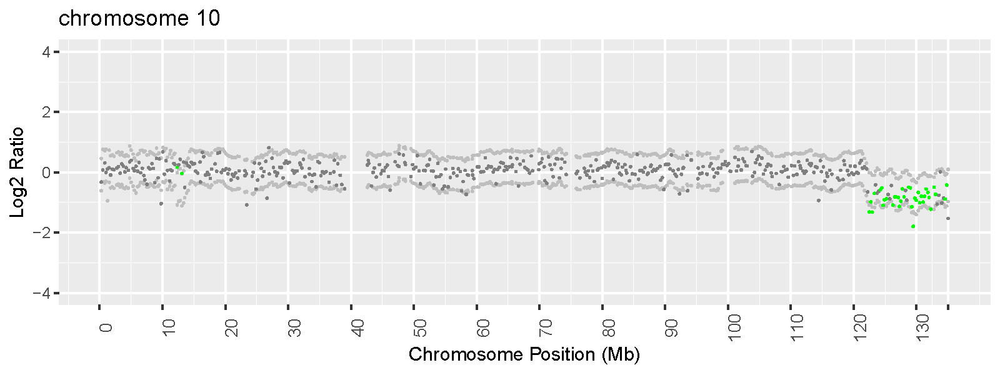

```{r setup, include = FALSE}
knitr::opts_chunk$set(
  collapse = TRUE,
  comment = "#>"
)
```


CNV \left(copy number variation\right) is a type of structural variation, in which sections of the genome varies in number of repeats between individuals in the human population. CNV can be detected by read depth data from Next-generation Sequencing. A log2 ratio is often calculated by test and control samples to detect CNVs in read-depth based CNV calling algorithm. Control samples are required to decrease the noise from sequencing.

Log2 ratio equals: $$Log2\ Ratio\ =\ log_2\ \left( \frac{Depth\ of\ Test}{Depth\ of\ Baseline} \right)$$

The copy number of a region can be calculated by: $$Copy\ Number\ =\ Ploidy\ *\ 2\ ^ {Log2\ Ratio}$$and the ploidy equals 2 in autosomal, and 1 in sex chromosome.

Read depth is Gaussian and its log2-transforming ratio is also Gaussian, so we can use the Kalman Filter to estimate the real level of copy number. The Kalman Filter is a set of recursive linear estimation steps, which computes an estimation value at time `t+1` based on the estimation value at time `t` and the observation value at time `t+1`. Its estimates are linear combinations of Gaussian data when the noise disturbances are Gaussian. The Kalman Filter use estimation of log2 ratio in `t` region and observation one in `t+1` region to estimate the `t+1` region along the chromosome. Since the log2 ratio fluctuates around zero, and after the Kalman Filtering, the region that significantly differ from 0 can be called as CNV region.

`r Rpackage('kfltCNV')` is a R package using the Kalman Filter to infer and visualize copy number variations from high-throughput DNA sequencing data. It is designed for whole-genome and whole-exome data, but also hybrid capture short-read sequencing data. It's highly recommended that using other samples the same sequencing pool with test sample to create a control baseline. But if there is not control sample, the test one can be used to creat a baseline by other methods in this package.

# Quick Start

## Install kfltCNV

It can be installed from github:

```{r, eval = FALSE, echo = TRUE}
if (!requireNamespace("devtools", quietly = TRUE))
    install.packages("devtools")
devtools::install_github('sanadamakomi/kfltCNV')

library(kfltCNV)
```

Or you can download the source code and install the package by `R CMD INSTALL *.tar.gz`.

## Download database

If you want to annotate gene symbols to your CNV region, a `refGene.txt` file need to be download from [UCSC genome annotation database](http://hgdownload.cse.ucsc.edu/downloads.html#human), e.g. [hg19 database](http://hgdownload.cse.ucsc.edu/goldenPath/hg19/database). 

## CNV calling pipeline

Before calling CNV, you need to align sequencing reads \left(fileName.fastq\right) to a reference file \left(genome.fasta\right) and get an alignment file \left(fileName.bam\right). You can use tools like [BWA](http://bio-bwa.sourceforge.net/) or [Bowtie](http://bowtie-bio.sourceforge.net/bowtie2/index.shtml) to creat a BAM file, see details in [samtools](http://samtools.sourceforge.net/) and [SAM/BAM file format](http://samtools.github.io/hts-specs/SAMv1.pdf). After alignment, duplicated reads also need to remove by tools such as [Picard](https://broadinstitute.github.io/picard). By the way, a BAM index file \left(fileName.bam.bai\right) is also required. It can be created by *samtools*:

```{r, eval = FALSE, echo = TRUE}
samtools index fileName.bam
```

These are files for pipeline test:

```{r, eval = FALSE, echo = TRUE}
testBam <- system.file("extdata", 'testSample.bam', package = "kfltCNV")

# one or more control BAM files
controlBam1 <- system.file("extdata", 'controlSample.bam', package = "kfltCNV")

controlBam2 <- system.file("extdata", 'controlSample2.bam', package = "kfltCNV")

controlBam <- c(controlBam1, controlBam2)

# BED file
bed <- system.file("extdata", 'chr10_exome.bed', package = "kfltCNV")

# Annotation file
annotate <- system.file("extdata", 'hg19_refGene_chr10.txt', package = "kfltCNV")

# Baseline file 
baseline <- system.file("extdata", 'baseline.cov', package = "kfltCNV")
```

Run kfltCNV pipeline on a test BAM file and its control BAM files, and a BED file is optional to input when target capture sequencing data is used. If the whole-genome data are analysed, you can input the `binSize` rather than 'bedFile', by default `binSize` is 1E5. The following command use a target capture sequencing data to test:

```{r, eval = FALSE, echo = TRUE}
kfltBatch(testBam, controlBamFile = controlBam, bedFile = bed)

# Annotate 
kfltBatch(testBam, controlBamFile = controlBam, bedFile = bed, annote.database = annotate, outDir = '.')
```

Run by test BAM file by `shuffling` or `moving average` mode:

```{r, eval = FALSE, echo = TRUE}
kfltBatch(testBam, mode = "shuffle", bedFile = bed)
kfltBatch(testBam, mode = "movingAverage", bedFile = bed)
```

Reusing a baseline file:

```{r, eval = FALSE, echo = TRUE}
kfltBatch(testBam, baselineFile = baseline, bedFile = bed)
```

The default results are tabular and VCF files of CNVs and a PDF files to visualize CNV result. See detail instructions by `?kfltBatch`. 

# CNV calling steps

## Target

A BED file \left(fileName.bed\right) stores genomic regions for target capture kit, as provided by kit vendor. Three required BED fields are chromosome name, start and end position. Since the regions in a BED file often share different width, you can use `kfltCNV::splitBed()` to split region into equal size to uniform and eliminate the effects of region's length.

```{r, eval = FALSE, echo = TRUE}
splitBed(bed, width = 1E2)
```

If you want to analyse WGS data that target is the whole genome, you can split genome region into windows by ``kfltCNV::splitGenome()`. The parameter `genomeSeqinfo` is a GenomeInfoDb object which contain the sequence information. If you need higher resolution, you can select a smaller average width for your target. By default `width` is 1E5. 

```{r, eval = FALSE, echo = TRUE}
bamSeqinfo <- seqinfo(BamFile(testBam))

splitGenome(bamSeqinfo, width = 1E4)
```

## Coverage

Calculate coverage in the given regions from BAM read depths. `kfltCNV::performCreateCovFile()` can process several BAM files, and it also can perform in multithreading with number of threads you input in the option `thread` when run in Linux system. By the way if you would like to filter out reads with bad mapping qualty, you could specify the minimum mapq in parameter `mapq.filter`. Reads with mapping qualities less than `mapqFilter` are discarded.

```{r, eval = FALSE, echo = TRUE}
performCreateCovFile(c(testBam, controlBam), bedFile = bed, mapq.filter = 30)
```

The result is a coverage file \left(filename.cov\right) which have four columns indicating chromosome name, chromosome start, chromosome end and depth of coverage, without a header line.

If you would like to input a specific genomic range to calculate depth, the `kfltCNV::depthOfRegion()` can help. It will retrun a GenomicRanges object with a column named `depth` representing the sequencing depth in this region. If you run scripts in Linux system, `kfltCNV::depthOfRegionMultiCore()` can perform in multithreading with number of threads input.

```{r, eval = FALSE, echo = TRUE}
region <- bedtoGRange(bed, bamSeqinfo)
gr <- depthOfRegion(region, bamPath = testBam)
head(gr)
```

And the GenomicRanges object returned can be saved as a coverage file by `kfltCNV::writeCovFile()`.

```{r, eval = FALSE, echo = TRUE}
writeCovFile(gr, path = 'testSample.cov')
```

## Baseline

This step will compile a baseline from the given coverage files. Following files are used to test:

```{r, eval = FALSE, echo = TRUE}
testCov <- system.file("extdata", 'testSample.cov', package = "kfltCNV")

contolCov1 <- system.file("extdata", 'controlSample.cov', package = "kfltCNV")

contolCov2 <- system.file("extdata", 'controlSample2.cov', package = "kfltCNV")

```

When you input test and control coverage files, first, coverage files from different samples need to be merged by region if they share the same region. You could use `kfltCNV::isSameBedFile()` to check two BED-life file whether they have the same region.

```{r, eval = FALSE, echo = TRUE}
isSameBedFile(testCov, contolCov1)
isSameBedFile(testCov, contolCov2)
```
If it return `FALSE`, you could use `kfltCNV::linearInterpolationCov()` to realign the coverage file and fit `NA` data point by linear interpolation. See details in  `?linearInterpolationCov`. After that you could merge coverage files and align them by regions.

```{r, eval = FALSE, echo = TRUE}
covmatrix <- mergerCovFiles(c(testCov, contolCov1, contolCov2))
head(covmatrix)
```

Then all samples will be scaled to the same total bases to decrease bias from sequencing. We recommand to normalize test and control samples simultaneously.

```{r, eval = FALSE, echo = TRUE}
covmatrix.nor <- normalizeCovMatrix(covmatrix)
head(covmatrix.nor)
```

Finally a baseline will be created by normalized control samples.

```{r, eval = FALSE, echo = TRUE}
baseline.control <- createControlBaseline(covmatrix.nor[,-4])
head(baseline.control)
```

If you only have the test sample's data, maybe you could try `kfltCNV::createShuffleBaseline()` or `kfltCNV::createMoveAveBaseline()` to create the baseline. The former method will randomly order the depth of each chromosome or the whole sample, while the latter computes the moving average depth of each chromosome as a baseline.

```{r, eval = FALSE, echo = TRUE}
baseline.shuffle <- createShuffleBaseline(covmatrix.nor[,1:4])
baseline.moveaverage <- createMoveAveBaseline(covmatrix.nor[,1:4], step=10)
```

And the steps above can be processed by `kfltCNV::createBaseline()`. Beside the default method `control`, you could select alternative `mode` from `shuffle` or `movingAverage`. 

```{r, eval = FALSE, echo = TRUE}
createBaseline(c(contolCov1, contolCov2), path = 'baseline.cov')
createBaseline(testCov, mode = 'shuffle', path = 'shuffle.cov')
createBaseline(testCov, mode = 'movingAverage', path = 'movingAverage.cov')
```

## Fit

Combine test and baseline depth to calculate log2 ratio of test and baseline. The region of which depth in baseline low than the parameter `badDepth` will be set to `NA`.

```{r, eval = FALSE, echo = TRUE}
log2ratio <- calculateLog2ratio(covmatrix.nor[,4], baseline.control[,4], badDepth = 1)
```

`kfltCNV::performFitCovFile()` is a batch pipeline to create a log2 ratio file \left(fileName.fit\right), which is the input file of following step. It contains two steps above, i.e. creating baseline and calculating log2 ratio. Also, you could input `mode` to creating baseline by different methods, by default is `control`. 

```{r, eval = FALSE, echo = TRUE}
performFitCovFile(testCov, path = 'testSample.fit', controlFile = c(contolCov1, contolCov2))
```

It can also reuse a baseline file to create the log2 ratio file.

```{r, eval = FALSE, echo = TRUE}
performFitCovFile(testCov, path = 'testSample.fit', baselineFile = baseline)
```

## The Kalman Filter

`r Rpackage('kfltCNV')` uses the log2 ratio to do Kalman Filtering and estimates the level of copy number.

```{r, eval = FALSE, echo = TRUE}
kflt(
yt = matrix(data = log2ratio, nrow = 1),
ct = matrix(data = 1, nrow = 1))
```

The batch pipeline to run `kfltCNV::kflt()` is `kfltCNV::performRunKflt()`. Results are two files, a estimated log2 ratio state file \left(fileName.state\right) and a parameter file \left(fileName.parameter\right).

```{r, eval = FALSE, echo = TRUE}
fitFile <- system.file("extdata", 'testSample.fit', package = "kfltCNV")
performRunKflt(fitFile, binSize = 1E2)
```

The log2 ratio state file (fileName.state) has ten columns and the first six columns are from the log2 ratio file (fileName.fit). And another four columns are estimated log2 ratio state from the Kalman filter. They are:

`state` - The log2 ratio state after kalman filtering.

`statUp` - The upper limmit of state confidence interval.

`statDown` - The lower limmit of state confidence interval.

`report` - The label representing the copy number variation level of a region. It has three levels i.e. `gain`, `loss` and `average`.

The parameter file (fileName.parameter) stores a best set of parameters found by `stats::optim()`. `kfltCNV::performRunKflt()` use the `FKF::fkf()` function in the `r CRANpkg('FKF')` to perform Kalman filtering and `stats::optim()` to estimate parameters. By default it will simulate a `ARMA(0,5)-process`, so a parameter file has 6 columns named `par1` to `par6` representing six parameters in ARMA process, while the first column is chromosome name because it performs Kalman filtering in each chromosome.

## Calling CNV

Call CNVs from result of the Kalman Filter. `kfltCNV::performCallCNV()` is a batch pipeline to call CNV. And the option `threshold` and `min.probes` are used to control which CNVs will be reported. A CNV of which log2 ratio is out of range from inverse `threshold` to `threshold`, or the numbers of probes supporting this CNV is lower than `min.probes` will not be exported. 

```{r, eval = FALSE, echo = TRUE}
stateFile <- system.file("extdata", 'testSample.state', package = "kfltCNV")
performCallCNV(fitFile)
```

By the way if you would like to output the CNV result by gene, you could input the annotation file to `annote.database`.

```{r, eval = FALSE, echo = TRUE}
performCallCNV(fitFile, annote.database = annotate)
```

The result can be a VCF file or a tabular file based on `out.type`. The VCF file format is [VCFv4.2](https://samtools.github.io/hts-specs/VCFv4.2.pdf). And the tabular file has nine columns while a gene CNV result will also have a column named `gene` if you input an annotation database file. 

`chr` - Chromosome name.

`start` - The start position of CNV segment.

`end` - The end position of CNV segment.

`svtype` - `DUP` or `DEL` representing copy number gains or losses in CNV segment.

`log2ratio` - The log2 ratio of CNV segment.

`probe` - The number of bins covered by CNV segment.

`depth` - The median depth of CNV segment in test sample.

`baseline` - The median depth of CNV segment in baseline.

`cn` - Copy number of CNV segment.

`gene` - Gene symbol.

You could also process several steps to get the same result as `kfltCNV::performCallCNV()`. 

First, if you wants gene-symbol annotated result, you should annotate gene symbol to the log2 ratio state file. `kfltCNV::annovateBedFormat()` can annotate gene symbol to the state file and add a column named `gene` after the last column in the state file.

```{r, eval = FALSE, echo = TRUE}
annovateBedFormat(stateFile, 'testSample.anno.state', annote.database = annotate)
```

Then `kfltCNV::callGainCNV()` and  `kfltCNV::callLossCNV()` could be use to call copy number gain and loss respectively. If there is no CNV, it will return `NULL`. The parameter `gapwidth` is used to merge CNV regions of which gap is less than input. Moreover if you have gene-symbol annotated result, you could use `kfltCNV::callCNVGene()` to call gene CNVs.

```{r, eval = FALSE, echo = TRUE}
annoStateFile <- system.file("extdata", 'testSample.anno.state', package = "kfltCNV")
gain <- callGainCNV(stateFile, gapwidth = 0)
loss <- callLossCNV(stateFile, gapwidth = 0)
gene <- callCNVGene(stateFile, gapwidth = 0)
```

After calling, you could use `kfltCNV::outputTable()` and `kfltCNV::outputVcf` to output results. `info.vec` is required and the function will return elements from column names in `info.vec`. In addition the option `threshold` and `min.probes` are used to control which CNVs will be reported.

```{r, eval = FALSE, echo = TRUE}
# tabular
outputTable(loss, filepath = 'cnv.result.txt',
  info.vec =  c("svtype", "svlen", "end", "log2ratio", "probe", "depth", "baseline"))

#' # vcf file
outputVcf(loss, filepath = 'cnv.result.vcf', id = 'testSample',
  info.vec =  c("svtype", "svlen", "end", "log2ratio", "probe", "depth", "baseline"))

# vcf file adding gene
outputVcf(gene, filepath = 'cnv.result.vcf', id = 'testSample',
  info.vec =  c("svtype", "end", 'gene', "log2ratio", "probe", "depth", "baseline"),
  addinfo = '##INFO=<ID=GENE,Number=1,Type=String,Description="Gene symbol">')
```

## Visualization

`kfltCNV::plotKfltResult()` is used to visualize the CNV result. 

```{r, eval = FALSE, echo = TRUE}
plotKfltResult(stateFile)
```

The result is a scatterplot and each dark gray point represents the depth of region. The region with copy number gain and loss will respectively colored with red and green. And gray points are data of `statusUp` and `statusDown` in the state file.

```{r pressure, echo = FALSE, fig.cap = "Scatterplot of CNV result", out.width = '100%'}

```

# SessionInfo

```{r}
sessionInfo()
```
